# Task 1:

## **Installing VMware on Windows**

**Step 1:** Click on the link provided below. Now select the version you want to download and click on “Go to downloads”.

[https://customerconnect.vmware.com/en/downloads/](https://customerconnect.vmware.com/en/downloads/info/slug/desktop_end_user_computing/vmware_workstation_player/17_0)

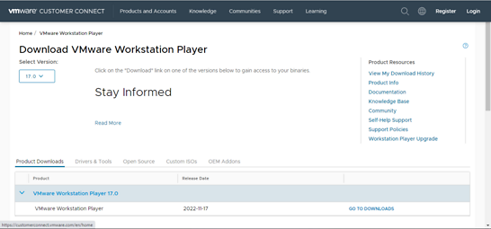

**Step 2:** Now, Click on download now. (Check which OS you are selecting).

**Step 3:** Open the (.exe) file and install it.

**Step 4:** Open the link below and download the Ubuntu ISO file.

> https://ubuntu.com/download/desktop

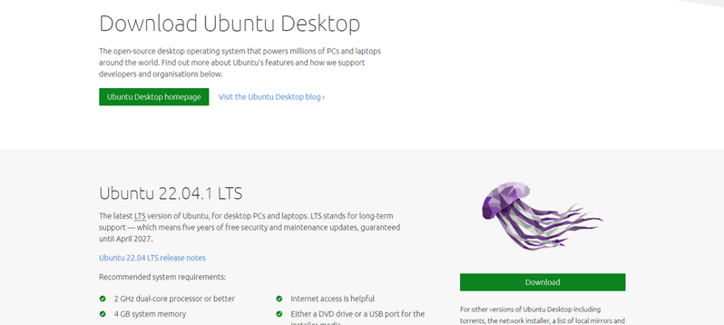

## **Installing Ubuntu in VMWare**

**Step 5:** Open the installed VMware application.

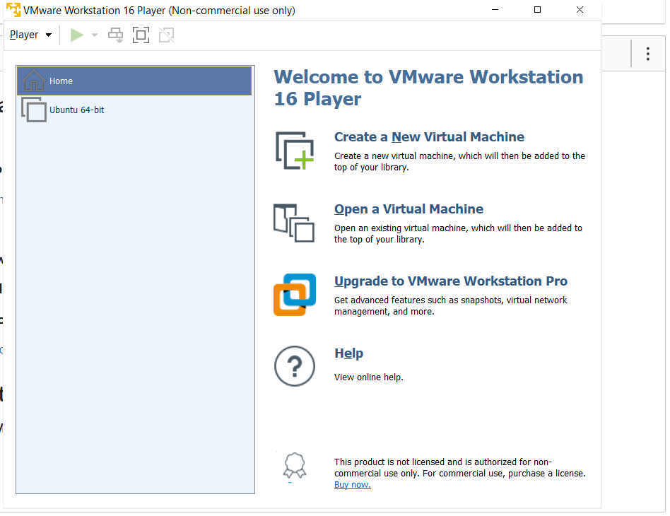

**Step 6:** Click on “Create new virtual machine”. Browse the ISO file that has been downloaded and select it. 

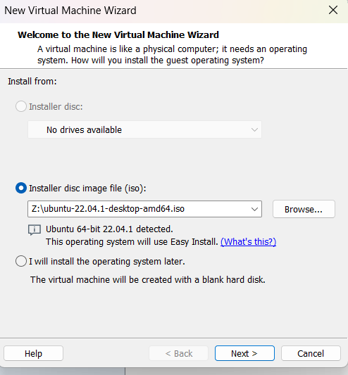

 

**Step 7:** Enter all the details >> click on next. Personalization of Virtual Machine.

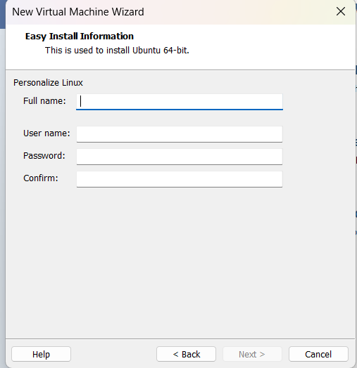

 

**Step 8:** Enter Virtual machine name >> click on next.

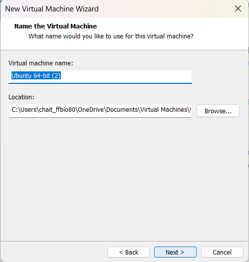

 

**Step 9:** Specify disk capacity >> click on next.

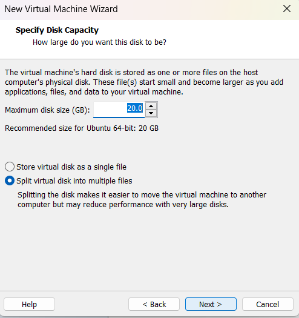

 

**Step 10:** If needed customize the hardware and click on finish.

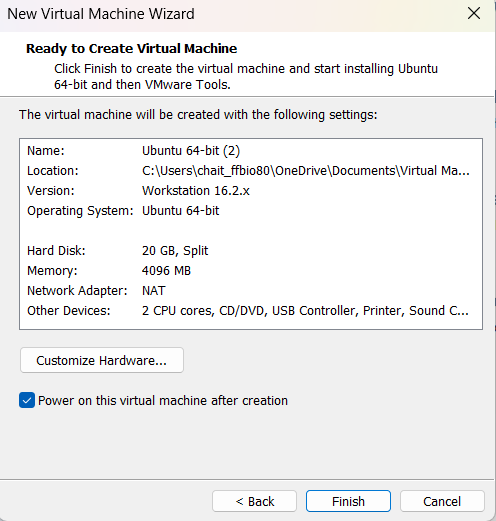

 

**Step 11:** Ubuntu has been successfully installed in VMWare. Now open VMware and click on ubuntu-64 which appears on the left panel. (If not directly opened). Select the language and click on next. Select the Normal or Minimal installation based on your requirements.

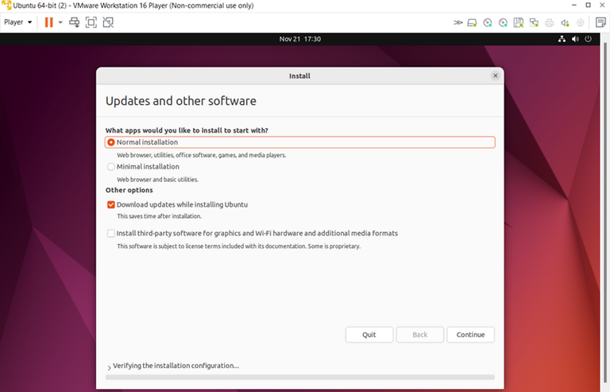

 

**Step 12:** Select Installation type >> Erase disk and install Ubuntu (This will not delete your windows data) >> Click on install now.

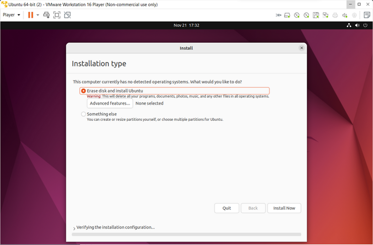

 

## Restart:

- After completing the installation and updates, restart the virtual machine.

Now, your Ubuntu installation on VMware should be properly set up. You can 

# Task 2:

## How to Create and Run a C\CPP file on ubuntu:

### First For Cpp Program:

**Step 1:** Select Terminal from search bar >> and type the command.

**"nano filename.cpp"**

**Step 2:** Write your code in open file >> and press **ctrl+s **to save file.

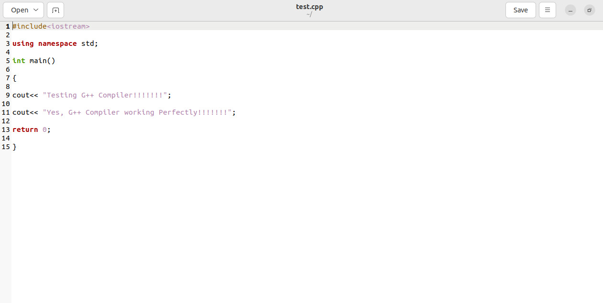

**Step 3:**To Compile this code using following steps:

**To compile:** g++ -o obj test.cpp

**To run:** ./obj

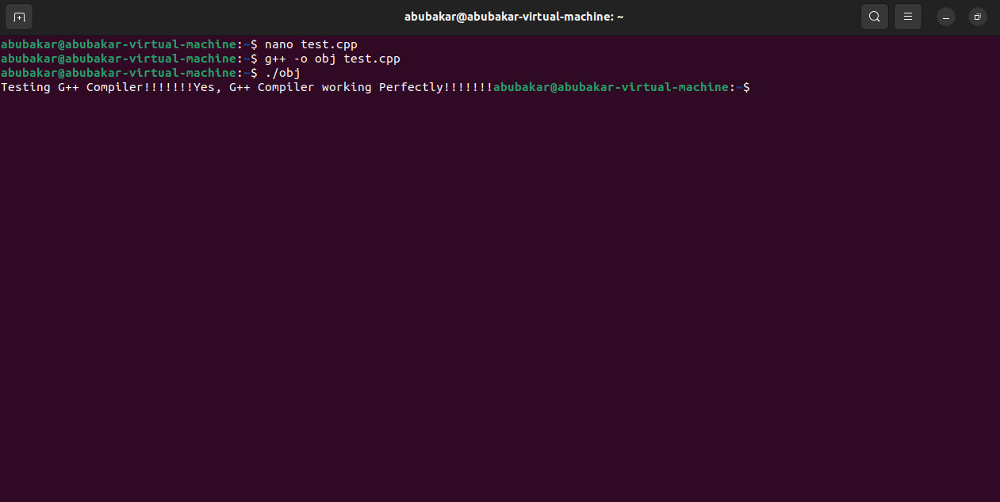

### Now for C Program:

**Step 1:** Select Terminal from search bar >> and type the command.

**"nano filename.c"**

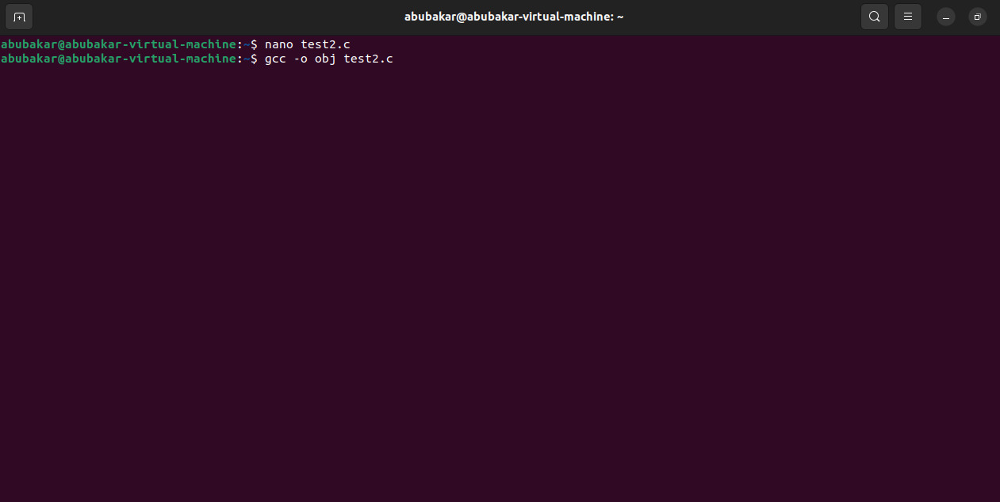

**Step 2:** Write your code in open file >> and press **ctrl+s **to save file.

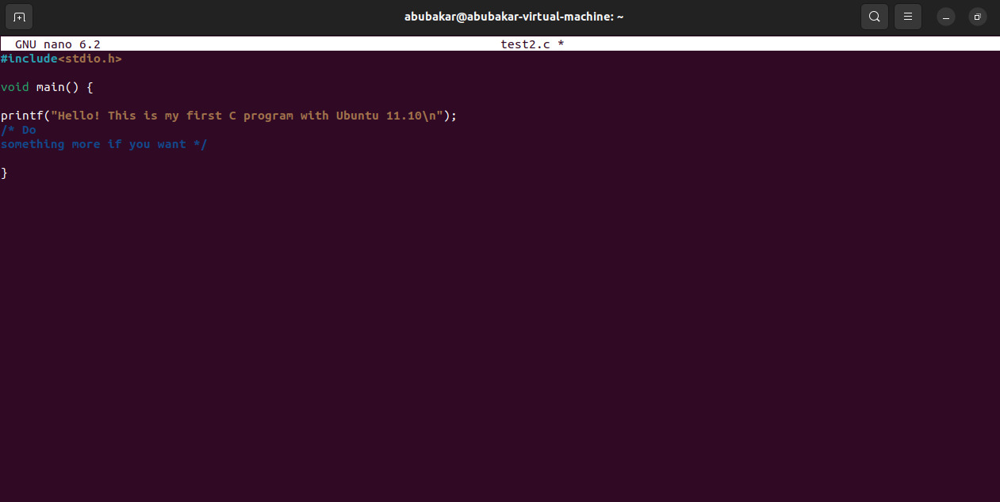

**Step 3:**To Compile this code using following steps:

**To compile:** gcc -o obj test2.c

**To run:** ./obj

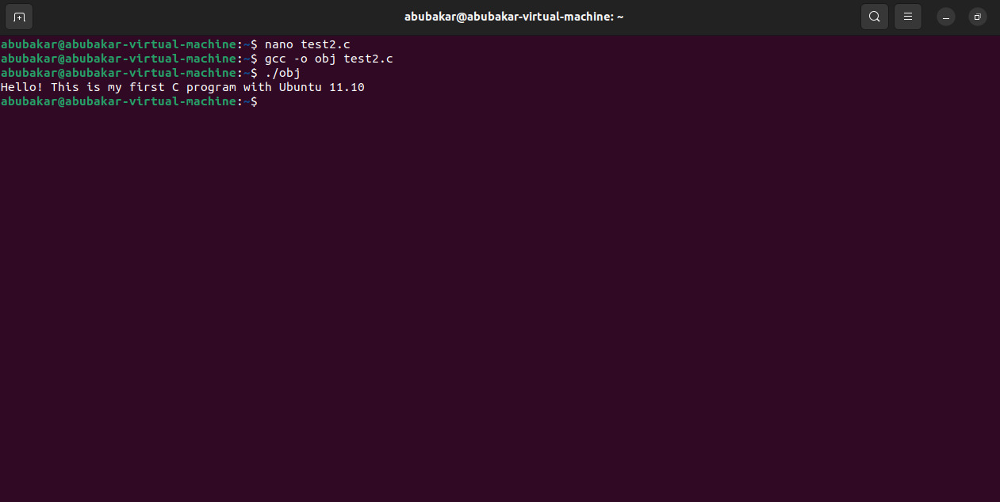

## Task 3:

https://github.com/Abubakar209/Operating-System-Lab
