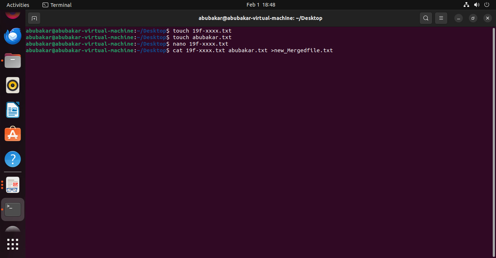
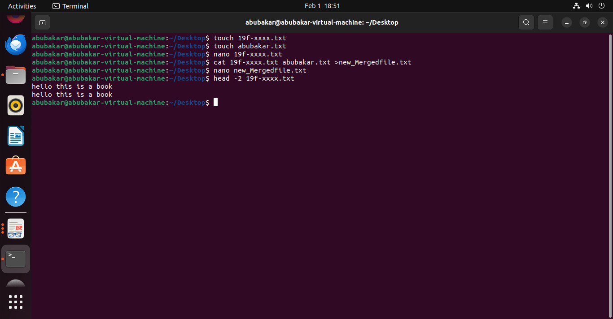
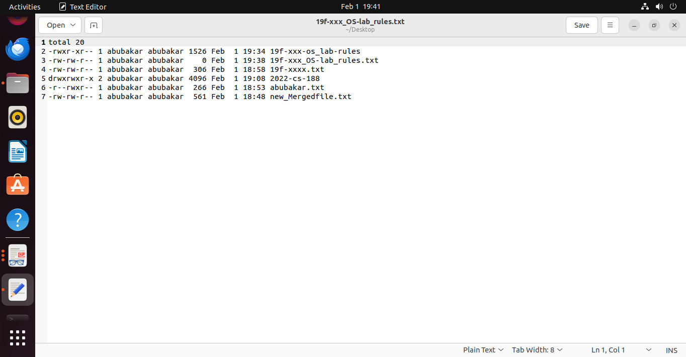

#                                                               Lab 3

## Task 1 :

You are required to help a new Ubuntu user in performing Ubuntu commands. Mr. Tom is new Ubuntu user. He want guidance regarding basic Ubuntu utilities to perform following tasks:

##### 1.**Create a file named “19f-XXXX.txt”. File must contain at least 10 lines.**

**Answer:**

1.1 touch command is used to create file **touch filename.txt**

1.2 nano command is used to open any file **nano filename.txt**

1.3 press **ctrl+x** to save that file.

##### **2. Create another file named “your name.txt”. File must contain at least 10 lines:**

2.1  touch command is used to create file **touch filename.txt**

2.2 nano command is used to open any file **nano filename.txt**

2.3 press **ctrl+x** to save that file.

##### **3. Merge the data of both files and Redirect the output to a new file:*

3.1 To merge the the existing data of file and create new output file use

 **cat filename1.txt filename2.txt >newfilename.txt**

3.2  View of new merged file

##### 5. Display the first two lines of first file:

5.1 to display the first to two line we use **head -2 filename.txt**

##### 6. Display the last two lines of second file:

6.1 to display the last to two line we use **tail -2 filename.txt**

##### 7. Finds the string (your roll#) from the first file:

7.1 To find the string in file we use **grep  "string to find " filename.txt** 

##### 8. Grant the execute permission of the second file to the group:

8.1 To Grant the permission we use  **chmod g+x filename.txt** 

##### 9. Remove the write permission for the owner.

9.1 To Remove write permission we use  **chmod u+w filename.txt** 

**10. Now Mr. Tom suddenly lost the track of his current location. Help him find his location:**

10.1 To find the present working directory we use **pwd**

##### 11. He wants the list of all files present on Desktop directory:

11.1 To Find the list of all present files on desktop directory we use **ls -l**

 

##### 12. Now he wanted to create a folder of his personal files and pictures named as your roll#:

12.1 To create a new folder we use **mkdir foldername**

.jpeg)

##### 13.Display the current time:

13.1 to display the current time we use **date**

##### 14. He is done with the task and he is happy with your work. He want to display a thankyou message: 

14.1 To display any  message type **echo your text**

  

## Task 2 :

##### 1. Create a file named “19f-XXX_OS-lab_rules.txt” using linux commands. The file must contain all lab rules covered in first lab:

##### 2. You want to set the rights of created file to this (- rwx r-x r--). For these rights, you are required to convert the given rights in numeric format using binary number system procedure covered in lecture. Show complete working.

2.1 To convert the text we use the rule first like r value is 4 , w is 2 ,x is 1 and -  is 0 so we add them like first one is for owner that is rwx its value is 4+2+1 which is 7 ,and for second r-x its value become   5 and r-- value is 4 as shown in picture

##### 3.   Now use the derived number to change the permission of a file using chmod command

 3.1 now for set the permission like that we use **chmod 754 fiilename.txt**

now the permission is set to the desired permission.

#####  4. Append the output of ls command to created file:

4.1 to append the output of ls command to created file we use 

 **ls -l >> filename.txt**

